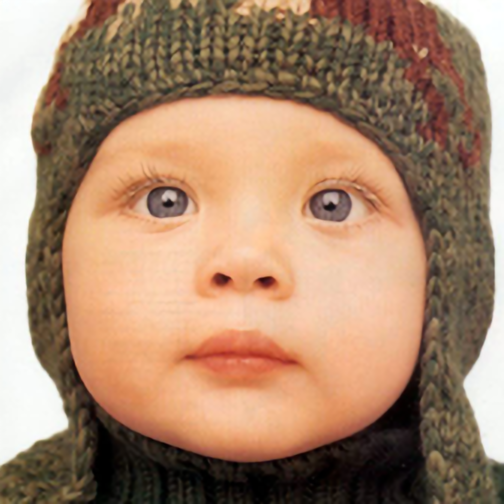
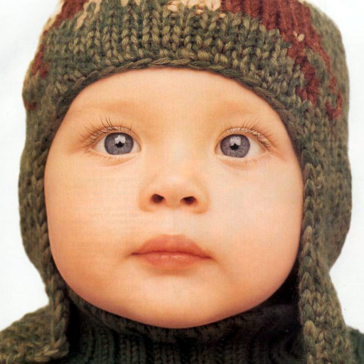
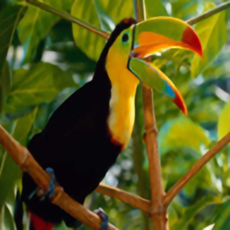
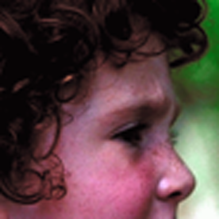
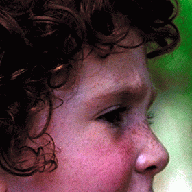
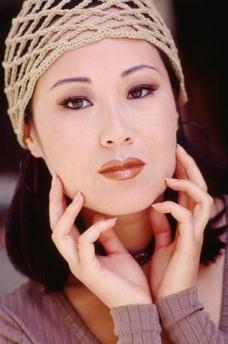

# super-resolution
## Model structure

## train
```python
python train.py --resume checkpoint/model.pth
```
## demo
```python
python demo.py 
```
## result
| LR | SR | HR |
| ---- | ----------- | --- |
|| |   |
|| |   |
|| |   |
|| |   |
|| |   |
## video demo
[](https://www.youtube.com/watch?v=V3eUNIprdOM)
