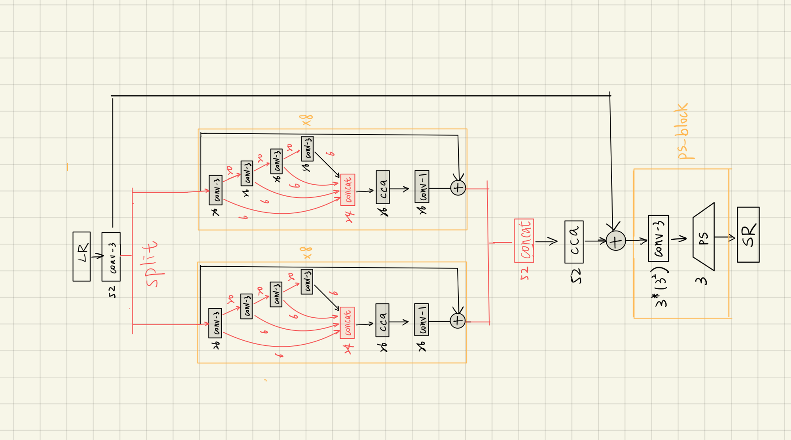

# super-resolution
Image super-resolution using IMDN (information multi-distillation network) modified with multi-head structure with pytorch 
## Model structure

## File system
**DATASET** : [DIV2K](https://data.vision.ee.ethz.ch/cvl/DIV2K/), [Flickr2K](https://cv.snu.ac.kr/research/EDSR/Flickr2K.tar)   
You should download dataset, then run png2npy.py to convert png to npy
```python
python png2npy.py
```
* DIV2K
  * DIV2K_train_HR
  * DIV2K_train_LR_bicubic
  * DIV2K_valid_HR
  * DIV2K_valid_LR_bicubic
* Flickr2K
    * Flickr2K_HR
    * Flickr2K_LR_bicubic
    * Flickr2K_LR_unknown
* DIV2K_decoded
    * DIV2K_HR_train
    * DIV2K_HR_valid
    * DIV2K_LR_bicubic_train
        * X3
    * DIV2K_LR_bicubic_valid
* Flickr2K_decoded
    * Flickr2K_HR
    * Flickr2K_LR_bicubic
        * X3
## train
then run train.py
```python
python train.py
```
without pretrained model
```python
python train.py --resume checkpoint/model.pth
```
with pretrained model

## demo
```python
python demo.py 
```
## result
| LR | SR | HR |
| ---- | ----------- | --- |
|| |   |

## video demo
[](https://www.youtube.com/watch?v=V3eUNIprdOM)
